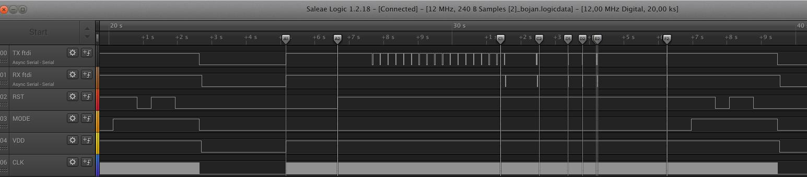
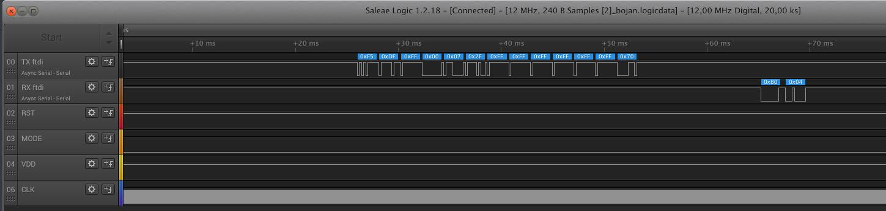
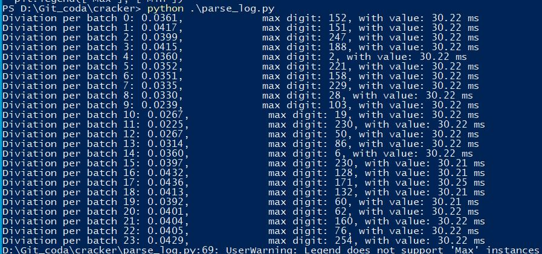
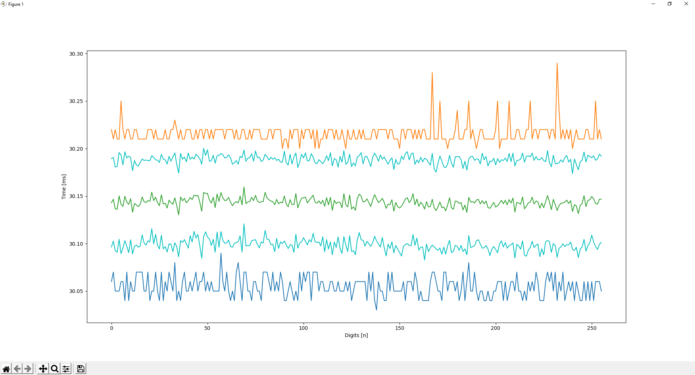
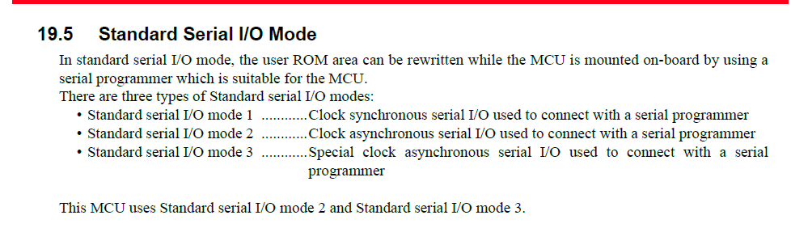

# Cracker

Guess ID for microprocessor Renesas R8C. Main idea is to send header+key and measure response time.
If byte of ID is correct, response time is expected to be longer.

## Project status

Project was unsuccessful. The main issue was that from measuring UART speed, even on slow uC clock (250 kHz) generated from Arduino time difference is not visible.
My current understanding is that cracking ID with this method is not feasible for this family of microprocessors.

## Signal description



Signal are measured directly on IO of R8C processor, while running Arduino sketch on Arduino-UNO hardware (arduino/sketch_mar30_a).

Payload is split into multiple sections witch are necessary for correct behavior.

* A) Wait for R8C to wake into boot mode
* B) Send 16 x 0x00 on 9600 baud rate
* C) Change baud rate to 115200
* D) Emulating packets used in flash development kit
* E) Send payload (header + 7byte ID code)
* F) Emulating packet used in flash development kit (from E to end)


##  Payload description



Payload contains 5-byte header:
* 0xF5, 0xDF, 0xFF, 0x00, 0x07

Following 7-byte ID key (in this case):
* 0x2F, 0xFF, 0xFF, 0xFF, 0xFF, 0xFF, 0xFF

Program is searching from 0 to 255 for correct 1 byte of ID. In this case (0x2F)


## How to run

1) Install Python+3.5, pip

``` shell
 $ pip install -r requirements.txt
```

2) Connect Arduino-UNO with this GPIO. VDD_SWITCH is connected with external HW via PNP transistor. Between VCC and GND is also external resistor(500R) in order to discharge external capacitance when VDD is off
``` C++
namespace HW {
// Hardware definition
constexpr uint8_t MODE = 8;
constexpr uint8_t RESET = 4;
constexpr uint8_t VDD_SWITCH = 5;
constexpr uint8_t RX_1 = 3;
constexpr uint8_t TX_1 = 9;
constexpr uint8_t BLANK = 12;
constexpr uint8_t CLK = 11;
constexpr uint8_t BUTTON = 6;
constexpr uint8_t UART_CLK = 10;
} // namespace HW
```

2) Open Putty or other serial terminal on 9600 baud-rate, and write output to file. Optionally you can measure signals with logic analyzer to verify correct behavior.
3) To display following charts you can run (this need at least 1 hr to go over all 256 combinations)

``` shell
$ python parse_log.py
```

## Description of generated data



After running for approximately 20 hr and logging putty output the following histogram appeared.


Blue histogram display times where n-th digit took longer to replay with wrong key (0x80, 0x04).
Similarly Orange histogram display shorter response times.



Chart display average (green), min (blue), max (orange), 1 sigma confidence interval (cyan) time for each 256 combination for 0-th ID code.

### Conclusion

In this case Correct key was: (0x00, 0x00, 0x00, 0x00, 0x00, 0x00, 0x00).
From histogram alone, and/or response time it is unable to find any correct 1-byte of ID code. Therefore this method of measuring response time has proven to be infeasible for this family of microprocessors.


## Explanation



This method shuld be possible on any R8C microprocessor with support of mode 1 (synchronous UART) and with busy IO-flag.