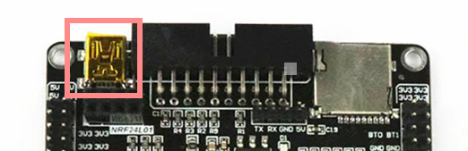
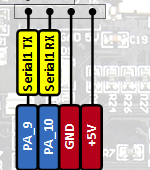

# Cracker STM32 port

This is the STM32 port of the R8C cracker. The hope here is, that a faster CPU (STM32F407) will detect the subtle differences in response times.

## Uploading the software

The STM32F407 software must be uploaded via the debug port. This is done via a programmer (ST-LINK, J-Link, ...) over the SWD or JTAG port. 

Perhaps the USB port could be used by putting the device in USB DFU mode, but I haven't tested this yet.

## PC connection

To communicate with your PC, STM32F407 uses one USB port as a virtual COM port. 

On the STM32F407VET black board this is the mini USB port at the front.

## Target connections

How to connect STM32F407VET black board for cracking.

### UART target

Target UART connection is done at the board UART header.

### Transfer triggers

Times between setting the UART transfer flag, and the actual message appearing on the UART lines, can differ a lot and does not represent a reliable way to measure the response time. That is where transfer triggers come into play.

Transfer triggers are two pins that are directly connected to UART RX and TX pins. This way, once the message is sent, a trigger connected to TX pin starts the timer. Once the target responds, the other trigger connected to the RX pin stops the timer.

To connect on the STM32F407VET black board jump the following pins together: 
	PC8->PA10
	PC7->PA9
	
### Target reset pin

STM32F407 has 5V tolerant pin, but cannot output 5V at its pins. If the target device is run at 5V, holding the reset ping at 3.3V doesn't work (tested on R8C). To combat this, an external pull up resistor must be used, and STM32F407 configures reset pin with open drain. 

To connect reset on the STM32F407VET black board:
	PE5->target reset (use pullup resistor from the 5V line)
	
### Target MODE pin

Target MODE pin is needed to put the target into programming mode.

To connect MODE on the STM32F407VET black board:
	PE6->target MODE
	
### Start key

To initiate the cracking, key0 on the STM32F407VET black board or pull low PE4 pin. 

